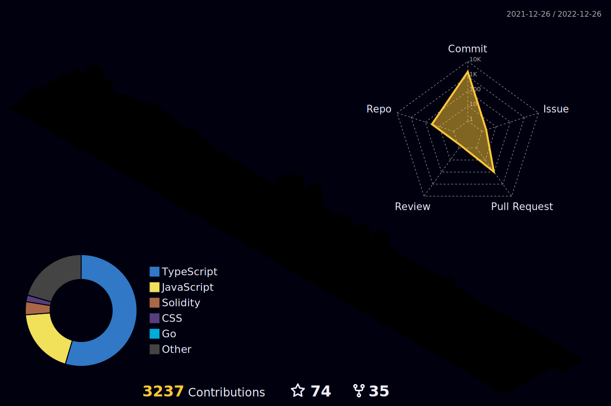

  

###

Motivated and accomplished Full Stack Developer with multifaceted experience and expertise in multiple software applications. 
A consummate professional with comprehensive business and technical acumen, proven experience with regulatory compliance, and effective communication prowess. 
Innate ability to motivate and gain trust with diverse teams in complex situations and challenging environments. 
Collaborative Team Building | Team Development | Process Improvement | Communication Skills | Strategic Vision | Critical Thinking | Creative Problem Solving | Scalability

<h2 align="left" id="macropower-tech">Favorite Tech</h2>

> Programming languages.

    
    
    
    
    
    
    
    
    
    
    
    

> Databases.

    
    
    
    

> Frameworks and Libraries.

    
    
    
    
    

> Cloud hosting.

    
    
    
    
    
    

<h2 align="left" id="macropower-tech">Github Status</h2>

 

> GitHub Profile Status

  

    
    

 

> GitHub 3D Contributors

 

  
  
  

